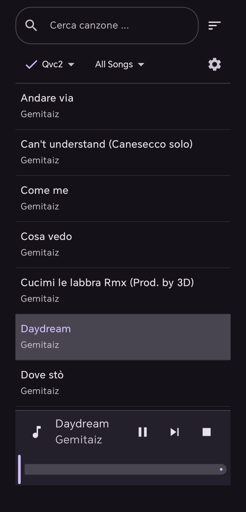
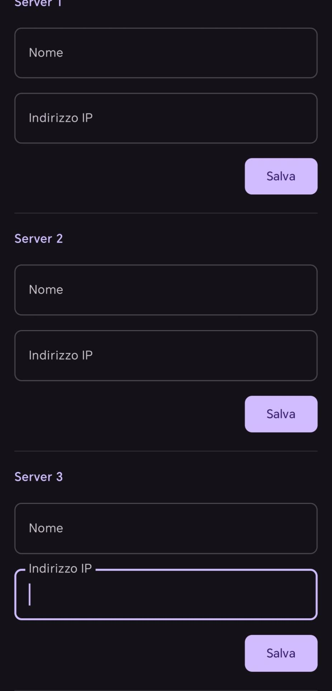

<div align="center">

# MyMP — Personal Music Player per Android

**Un client Android per lo streaming musicale, pensato prima di tutto per server self-hosted, sviluppato in Kotlin & Jetpack Compose.**

[🇬🇧 Read in English](README.md)

</div>

---

## Screenshot

<p align="center">
  
  &nbsp;&nbsp;
  
</p>
<p align="center">
  <em>Schermata principale (ricerca, ordinamento, riproduzione) &nbsp;·&nbsp; Schermata impostazioni (configurazione server)</em>
</p>

---

## Panoramica

MyMP è un'app Android per ascoltare in streaming la propria libreria musicale da server locali o remoti. È pensata per funzionare sia con server domestici (NAS, PC) sia con server pubblici che distribuiscono musica priva di copyright o a licenza libera — contenuti spesso non disponibili sulle piattaforme di streaming commerciali.

L'utente configura fino a tre server tramite indirizzo IP o URL, sincronizza il catalogo dei brani e li riproduce in streaming direttamente dall'app — con caching locale completo tramite Room per un'esperienza offline-friendly.

Il progetto segue un'**architettura MVVM** ed è stato realizzato come esercizio pratico di sviluppo Android in stile "production": gestione reattiva dello stato, servizi in background, persistenza locale e networking REST.

---

## Indice

- [Funzionalità](#funzionalità)
- [Stack Tecnologico](#stack-tecnologico)
- [Come Iniziare](#come-iniziare)
- [API del Server](#api-del-server)
- [Dettagli Architetturali](#dettagli-architetturali)
- [Permessi](#permessi)
- [Licenza](#licenza)

---

## Funzionalità

### Gestione server
- Configurazione di **3 slot server** (nome + indirizzo IP/URL) dalla schermata Impostazioni
- Supporto per server locali (rete domestica) e server remoti/pubblici
- Selezione del server attivo tramite dropdown nella schermata principale
- Normalizzazione automatica dell'URL (aggiunta di `http://` se assente)

### Sincronizzazione catalogo
- Recupero del catalogo brani via REST (`GET /manifest.json`) con Retrofit
- Sincronizzazione on-demand al click sul server
- **Upsert intelligente**: i brani esistenti vengono aggiornati preservando il loro ID locale, quelli rimossi dal server vengono cancellati — le playlist non vengono mai distrutte da una re-sync
- Database locale Room con separazione dei brani per server (`serverId`)
- Sincronizzazione gestita via WorkManager con retry automatico (fino a 3 tentativi)

### Riproduzione
- Streaming audio in rete tramite `MediaPlayer` (sorgenti locali o remote)
- Riproduzione in background tramite **Foreground Service** (`MusicService`)
- Notifica di sistema con controlli play/pausa, skip e stop
- **Mini player bar** persistente in fondo alla schermata principale
- **Barra di avanzamento** interattiva con seek tramite trascinamento
- Aggiornamento in tempo reale della mini player bar su skip, fine brano, pausa e stop

### Playlist
- Playlist personali **trasversali ai server** — i brani possono provenire da server diversi e coesistere nella stessa playlist
- Aggiunta brani tramite **pressione prolungata** sulla canzone → dialog con playlist esistenti + opzione "Crea nuova"
- Rimozione brani tramite **pressione prolungata** → dialog di conferma
- Navigazione tra le playlist tramite dropdown nella schermata principale
- L'eliminazione di una playlist rimuove a cascata tutti i riferimenti ai brani
- Se un brano viene rimosso dal server durante una re-sync, sparisce automaticamente anche dalle playlist che lo contenevano (`ON DELETE CASCADE`)

### Ricerca e ordinamento
- **Ricerca in tempo reale** per titolo o artista
- **4 modalità di ordinamento**: Titolo A→Z, Titolo Z→A, Artista A→Z, Artista Z→A
- Feedback visivo della modalità di ordinamento attiva tramite Toast
- Ricerca e ordinamento applicati sia alla lista brani del server sia alla vista playlist

### UI
- **Tema scuro** forzato, design Material 3
- Dropdown per la selezione di server e playlist, con segno di spunta sull'elemento attivo
- Brano in riproduzione evidenziato con colore accent

---

## Stack Tecnologico

| Categoria | Tecnologia |
|---|---|
| Linguaggio | Kotlin |
| UI | Jetpack Compose, Material 3 |
| Architettura | MVVM |
| Persistenza locale | Room |
| Networking | Retrofit |
| Lavoro in background | WorkManager, Foreground Service |
| Serializzazione | kotlinx.serialization |
| Navigazione | Navigation Compose |

<details>
<summary>Versioni complete delle dipendenze</summary>

| Libreria | Versione |
|---|---|
| Kotlin | 2.2.10 |
| AGP | 9.1.1 |
| KSP | 2.1.20-2.0.1 |
| Jetpack Compose BOM | 2025.x |
| Room | 2.7.1 |
| Retrofit | 2.x |
| WorkManager | 2.x |
| Navigation Compose | 2.8.4 |
| kotlinx.serialization | 1.x |

</details>

**Ambiente:** Android Studio Meerkat 2024.3.1+, JDK 17+, Gradle 9.x (gestito da Android Studio)
**SDK:** minSdk 26 (Android 8.0), targetSdk 35 (Android 15), compileSdk 35

---

## Come Iniziare

### Compilazione da Android Studio
1. Clona il repository
2. Apri Android Studio → `File → Open` → seleziona la cartella del progetto
3. Attendi il completamento della sincronizzazione Gradle (la prima apertura richiede il download delle dipendenze)
4. Verifica che non ci siano errori nel pannello `Build`

### Esecuzione su emulatore
1. Apri `Device Manager` in Android Studio
2. Crea un Virtual Device con API 26 o superiore
3. Premi **Run ▶** e seleziona l'emulatore
4. Nota: lo streaming da server locali richiede che emulatore e server siano sulla stessa rete virtuale — per test completi è consigliato un dispositivo fisico

### Esecuzione su dispositivo fisico
1. Abilita le **Opzioni sviluppatore** (`Impostazioni → Info telefono → tocca 7 volte "Numero build"`)
2. Abilita il **Debug USB**
3. Collega il dispositivo via USB e autorizza il debug quando richiesto
4. Premi **Run ▶** in Android Studio e seleziona il dispositivo

---

## API del Server

MyMP richiede che il server esponga un endpoint `GET /manifest.json` che restituisca un array JSON con la seguente struttura:

```json
[
  {
    "id": 1,
    "title": "Nome brano",
    "artist": "Artista",
    "album": "Album",
    "filePath": "http://indirizzo-server/percorso/file.mp3"
  }
]
```

Non è richiesta alcuna API key — l'app si connette a server HTTP configurati manualmente dall'utente.

---

## Dettagli Architetturali

Alcuni dettagli implementativi degni di nota:

- **Database singleton tramite la classe `Application`** (`MyMPApplication`): garantisce un'unica istanza Room condivisa tra Activity e Worker, eliminando race condition su scritture concorrenti
- **Comunicazione `MusicService` → `ViewModel` tramite `StateFlow` condivisi** in `MyMPApplication`: la mini player bar riflette sempre lo stato reale del servizio di riproduzione, non uno stato ottimistico lato ViewModel
- **Upsert intelligente basato su un indice `UNIQUE`** su `(serverId, remoteId)` in `SongEntity`: permette di aggiornare i metadati dei brani senza rompere i riferimenti nelle playlist
- **Job cancellabile per il collector dei brani** (`songsCollectionJob`): evita l'accumulo di più collector su cambi rapidi di server, eliminando race condition sulla lista visualizzata

---

## Permessi

```xml
<uses-permission android:name="android.permission.INTERNET" />
<uses-permission android:name="android.permission.FOREGROUND_SERVICE" />
<uses-permission android:name="android.permission.FOREGROUND_SERVICE_MEDIA_PLAYBACK" />
<uses-permission android:name="android.permission.POST_NOTIFICATIONS" />
```

Il permesso `POST_NOTIFICATIONS` viene richiesto a runtime su Android 13+.

---

## Licenza

Questo progetto è distribuito con licenza MIT — vedi il file [LICENSE](LICENSE) per i dettagli.
